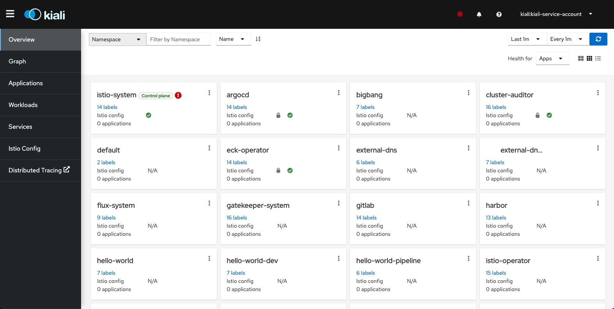
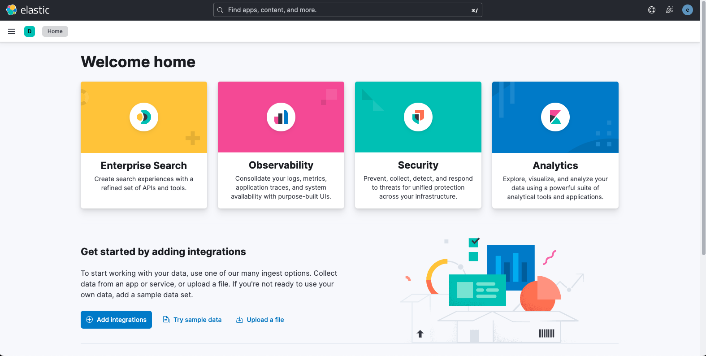
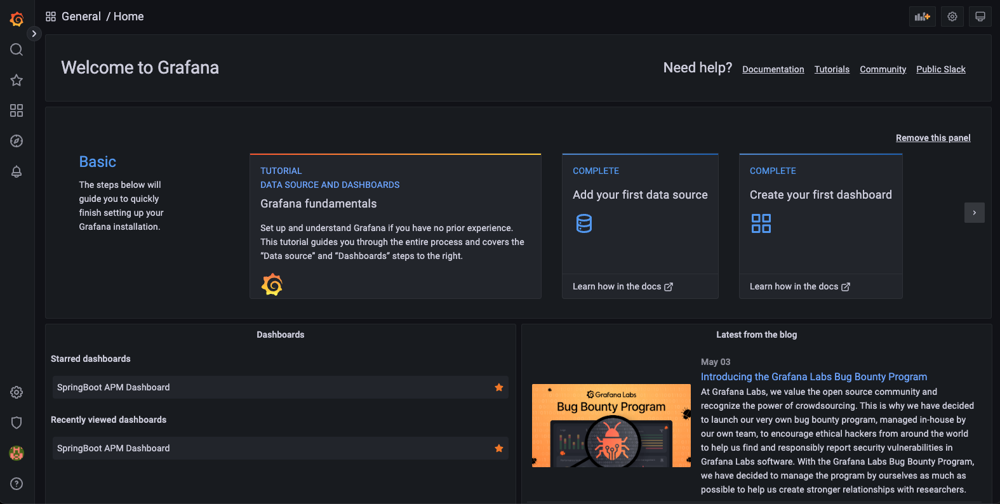

# Documenting Platform One Big Bang on Red Hat OpenShift

## Description

Red Hat effort to validate Big Bang on OpenShift 4.11.

## Install OpenShift

Workstation or bastion host prerequisites:
```
sudo dnf install wget git perl-Digest-SHA jq
wget https://mirror.openshift.com/pub/openshift-v4/x86_64/clients/ocp/stable/openshift-install-linux.tar.gz
wget https://mirror.openshift.com/pub/openshift-v4/x86_64/clients/ocp/stable/openshift-client-linux.tar.gz
mkdir ~/bin
tar xzvf openshift-client-linux.tar.gz
mv oc ~/bin/
mv kubectl ~/bin/
tar xzvf openshift-install-linux.tar.gz
mv openshift-install ~/bin/
chmod +x ~/bin/*
```

IPI includes all necessary IaC.

```
mkdir $HOME/cluster
cd $HOME/cluster
openshift-install create install-config
```

Modify install-config.yaml as necessary.

```
openshift-install create cluster
chmod g-r $HOME/cluster/auth/kubeconfig
```

## Configure OpenShift for Big Bang

```
curl -s "https://raw.githubusercontent.com/kubernetes-sigs/kustomize/master/hack/install_kustomize.sh"  | bash
curl https://raw.githubusercontent.com/helm/helm/main/scripts/get-helm-3 | bash
curl -s https://fluxcd.io/install.sh | sudo bash
cd $HOME
git clone https://repo1.dso.mil/platform-one/big-bang/bigbang.git
cd ~/bigbang
git checkout tags/$(grep 'tag:' base/gitrepository.yaml | awk '{print $2}')
oc login
```

### Install and Configure Flux
```
oc adm policy add-scc-to-group nonroot-v2 system:serviceaccounts:flux-system
```

Insert your values.
```
export REGISTRY1_USERNAME=xxxx
export REGISTRY1_PASSWORD=yyyy
```
```
env | grep REGISTRY1
cd ~/bigbang
$HOME/bigbang/scripts/install_flux.sh -u $REGISTRY1_USERNAME -p $REGISTRY1_PASSWORD
```

### Security Context Constraints for Big Bang Packages

OCP 4.11

```
oc adm policy add-scc-to-group nonroot-v2 system:serviceaccounts:gatekeeper-system
oc adm policy add-scc-to-group nonroot-v2 system:serviceaccounts:cluster-auditor
oc adm policy add-scc-to-group nonroot-v2 system:serviceaccounts:istio-operator
oc adm policy add-scc-to-group nonroot-v2 system:serviceaccounts:istio-system
oc adm policy add-scc-to-group nonroot-v2 system:serviceaccounts:eck-operator
oc adm policy add-scc-to-group nonroot-v2 system:serviceaccounts:logging
oc adm policy add-scc-to-group nonroot-v2 system:serviceaccounts:jaeger
oc adm policy add-scc-to-group anyuid system:serviceaccounts:kiali
oc adm policy add-scc-to-group nonroot-v2 system:serviceaccounts:monitoring
oc adm policy add-scc-to-group nonroot-v2 system:serviceaccounts:sonarqube
```

## Install Big Bang

Modify [demo_values.yaml](demo_values.yaml) as necessary.

Refer to [https://repo1.dso.mil/platform-one/big-bang/bigbang/-/blob/master/chart/values.yaml](https://repo1.dso.mil/platform-one/big-bang/bigbang/-/blob/master/chart/values.yaml) for the Big Bang-documented default values that are and can be overridden.

### Create Iron Bank Credentials File
```
cat << EOF > $HOME/ib_creds.yaml
registryCredentials:
  registry: registry1.dso.mil
  username: "$REGISTRY1_USERNAME"
  password: "$REGISTRY1_PASSWORD"
EOF
```

### Install Big Bang Umbrella Helm Chart

Install Big Bang umbrella helm chart. Modify file paths if necessary.
```
helm upgrade --install bigbang $HOME/bigbang/chart \
  --values https://repo1.dso.mil/platform-one/big-bang/bigbang/-/raw/master/chart/ingress-certs.yaml \
  --values $HOME/ib_creds.yaml \
  --values $HOME/demo_values.yaml \
  --namespace=bigbang --create-namespace
```

Monitor progress.
```
watch oc get hr -n bigbang
```

At the point where eck-operator shows `Helm install failed: timed out waiting for the condition` and where monitoring shows `Helm install failed: failed pre-install: timed out waiting for the condition`, proceed to the "Finalize Big Bang Install" step.

### Finalize Big Bang Install

```
oc adm policy add-scc-to-user node-exporter -z monitoring-monitoring-prometheus-node-exporter -n monitoring
oc adm policy add-scc-to-user node-exporter -z logging-fluent-bit -n logging
```
```
cat <<\EOF >> $HOME/NetworkAttachmentDefinition.yaml
apiVersion: "k8s.cni.cncf.io/v1"
kind: NetworkAttachmentDefinition
metadata:
  name: istio-cni
EOF
```

The following list of network attachment definitions will need to be tailored based on the selection of applications installed previously.

```
oc -n logging create -f ~/NetworkAttachmentDefinition.yaml
oc -n eck-operator create -f ~/NetworkAttachmentDefinition.yaml
oc -n kiali create -f ~/NetworkAttachmentDefinition.yaml
oc -n jaeger create -f ~/NetworkAttachmentDefinition.yaml
oc -n monitoring create -f ~/NetworkAttachmentDefinition.yaml
oc -n cluster-auditor create -f ~/NetworkAttachmentDefinition.yaml
oc -n sonarqube create -f ~/NetworkAttachmentDefinition.yaml
```

## Validate Big Bang on OpenShift

Refer to https://repo1.dso.mil/platform-one/big-bang/customers/bigbang/-/blob/master/docs/release/README.md#3-ui-tests

Follow application-specific guidance below depending on which applications you have installed.

Check virtual services.
```
oc get virtualservices -A
```

Confirm Istio ingress/gateway.
```
oc get svc/public-ingressgateway -n istio-system
```

Note that displayed IP address is internal. Get IP address of Istio ingress/gateway external to infrastructure. Use value of EXTERNAL-IP:
```
ping $EXTERNAL-IP
```

Use the external IP address in local workstation hosts file for each of the virtual services $HOSTS from output of `oc get virtualservices -A` command.

```
cat /etc/hosts
# Big Bang testing 2022-11-21
54.87.104.113 tracing.bigbang.dev
54.87.104.113 kiali.bigbang.dev
54.87.104.113 kibana.bigbang.dev
54.87.104.113 alertmanager.bigbang.dev
54.87.104.113 grafana.bigbang.dev
54.87.104.113 prometheus.bigbang.dev
```

Use web browser on external workstation to access each URL.










### gatekeeper

### eck-operator
See [here](eck-operator.md).

### elasticsearch-kibana

See [here](elasticsearch-kibana.md).
### fluent-bit

See [here](fluentbit.md).
### grafana

See [here](grafana.md).
### istio and istio-operator

See [here](istio.md).
### jaeger

See [here](jaeger.md).
### kiali

See [here](kiali.md)
### prometheus

See [here](prometheus.md).

### cluster-auditor

### ek

### monitoring

## Contacts

- Chris Mays, @chmays, chmays@redhat.com
- Arian Sanchez, @arisanch, arisanch@redhat.com
- Roger Seip, @rseip, rseip@redhat.com
- Ernest Chuang, @echuang, echuang@revacomm.com
- Ramin Rad, @oorah, rrad@oteemo.com
