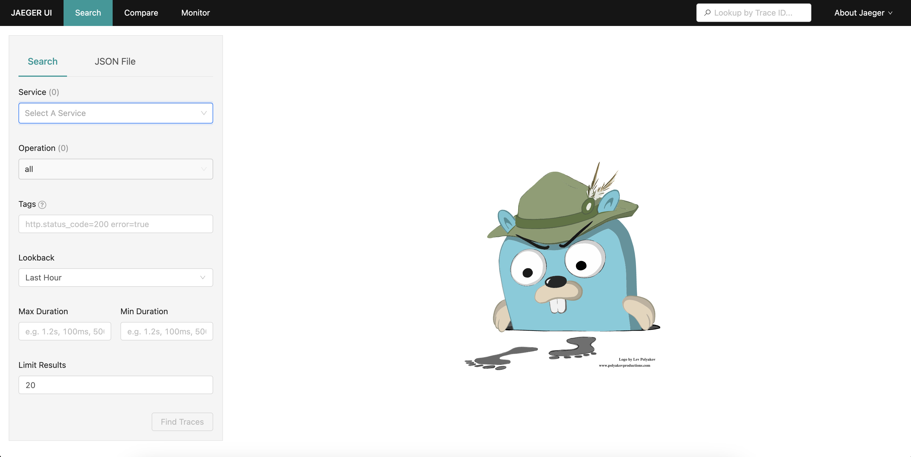

# Installing and validating Big Bang on Openshift 4.11+

## Description

Installing and validating Big Bang on Openshift 4.11+ .

## On local workstation or bastion

1. Install necessary tools.
```
sudo dnf install wget git perl-Digest-SHA jq
wget https://mirror.openshift.com/pub/openshift-v4/x86_64/clients/ocp/stable/openshift-install-linux.tar.gz
wget https://mirror.openshift.com/pub/openshift-v4/x86_64/clients/ocp/stable/openshift-client-linux.tar.gz
mkdir ~/bin
tar xzvf openshift-client-linux.tar.gz
mv oc ~/bin/
mv kubectl ~/bin/
tar xzvf openshift-install-linux.tar.gz
mv openshift-install ~/bin/
chmod +x ~/bin/*
```

2. Install OpenShift cluster.
Installer-provisioned installation (IPI) includes all necessary Infrastructure As Code (IaC).

```
mkdir $HOME/cluster
cd $HOME/cluster
openshift-install create install-config
```

Modify `install-config.yaml` as necessary to set instance types, cluster network CIDR, machine network CIDR, CNI driver, aws region, subnet ID, hosted Zone ID, ssh key for hosts.

**NOTE** For OpenShift 4.11 you will need to modify `networking.networkType` to `OVNKubernetes`. For OpenShift 4.12+, `OVNKubernetes` is the default and does not require modification.

```
openshift-install create cluster
chmod g-r $HOME/cluster/auth/kubeconfig
```

3. Install Kustomize, Flux, and clone Big Bang Git repo locally

```
curl -s "https://raw.githubusercontent.com/kubernetes-sigs/kustomize/master/hack/install_kustomize.sh"  | bash
curl https://raw.githubusercontent.com/helm/helm/main/scripts/get-helm-3 | bash
curl -s https://fluxcd.io/install.sh | sudo bash
cd $HOME
git clone https://repo1.dso.mil/platform-one/big-bang/bigbang.git
cd ~/bigbang
git checkout tags/$(grep 'tag:' base/gitrepository.yaml | awk '{print $2}')
oc login
```

## Install Flux into OpenShift

### Option A - Install Operator via OperatorHub

1. Login to OpenShift console as Administrator.
2. Click Operators -> OperatorHub.
3. Install Flux Community operator.

### Option B - Install via Big Bang install script

1. Modify SCC.
```
oc adm policy add-scc-to-group nonroot-v2 system:serviceaccounts:flux-system
```

2. Set Registry1 credentials.
```
export REGISTRY1_USERNAME=xxxx
export REGISTRY1_PASSWORD=yyyy
```

3. Run Big Bang Flux install script.
```
env | grep REGISTRY1
cd ~/bigbang
${HOME}/bigbang/scripts/install_flux.sh -u ${REGISTRY1_USERNAME} -p ${REGISTRY1_PASSWORD}
```

## Modify Security Context Constraints for Big Bang Packages

Red Hat is merging feature branches for Big Bang packages to automatically modify Security Context Constraints. This is necessary due to the more restrictive permissions Red Hat enables by default. Manual commands are no longer necessary. See demo_values.yaml for details. Affected service accounts include: gatekeeper-system, cluster-auditor, istio-operator, istio-system, eck-operator, logging, jaeger, kiali, monitoring, sonarqube, harbor, and gitlab.

## Install Big Bang on OpenShift

1. Modify [demo_values.yaml](demo_values.yaml) as necessary.

Refer to [https://repo1.dso.mil/platform-one/big-bang/bigbang/-/blob/master/chart/values.yaml](https://repo1.dso.mil/platform-one/big-bang/bigbang/-/blob/master/chart/values.yaml) for the Big Bang-documented default values that are and can be overridden.

2. Create Iron Bank Credentials File
```
cat << EOF > $HOME/ib_creds.yaml
registryCredentials:
  registry: registry1.dso.mil
  username: "$REGISTRY1_USERNAME"
  password: "$REGISTRY1_PASSWORD"
EOF
```
3. Install Big Bang Umbrella Helm Chart

Modify file paths if necessary.
**NOTE** The ingress-certs.yaml are pre-defined for the `bigbang.dev` domain and are managed by Platform One. For deployments using your own domain, you will need to create a wildcard certification and create your own `ingress-certs.yaml` that correspond to the various domain values you customize in `demo_values.yaml`.
```
helm upgrade --install bigbang $HOME/bigbang/chart \
  --values https://repo1.dso.mil/platform-one/big-bang/bigbang/-/raw/master/chart/ingress-certs.yaml \
  --values $HOME/ib_creds.yaml \
  --values $HOME/demo_values.yaml \
  --namespace=bigbang --create-namespace
```

4. Monitor progress.
```
watch oc get hr -n bigbang
```

## Validate Big Bang on OpenShift

Refer to https://repo1.dso.mil/platform-one/big-bang/customers/bigbang/-/blob/master/docs/release/README.md#3-ui-tests

Follow application-specific guidance below depending on which applications you have installed.

1. Check virtual services.
```
oc get virtualservices -A
```

2. Confirm Istio ingress/gateway.
```
INGRESS-IP=$(oc get svc/public-ingressgateway -n istio-system -o json | jq -r '.status.loadBalancer.ingress[] | .hostname')
ping ${INGRESS-IP}
```

3. Update /etc/hosts if not using DNS

Use the INGRESS-IP address in local workstation hosts file for each of the virtual services $HOSTS from output of `oc get virtualservices -A` command.

```
cat /etc/hosts
x.x.x.x tracing.bigbang.dev
x.x.x.x kiali.bigbang.dev
x.x.x.x kibana.bigbang.dev
x.x.x.x alertmanager.bigbang.dev
x.x.x.x grafana.bigbang.dev
x.x.x.x prometheus.bigbang.dev
x.x.x.x twistlock.bigbang.dev
x.x.x.x argocd.bigbang.dev
x.x.x.x anchore-api.bigbang.dev
x.x.x.x minio.bigbang.dev
x.x.x.x keycloak.bigbang.dev
x.x.x.x gitlab.bigbang.dev
x.x.x.x registry.bigbang.dev
x.x.x.x sonarqube.bigbang.dev
x.x.x.x neuvector.bigbang.dev
x.x.x.x harbor.bigbang.dev
```

4. Use web browser on external workstation to access each URL.

Jaeger does not require login.



Kiali requires login via token. To obtain this token, where xxxxx is the unique identifer:

```
oc get secret kiali-service-account-token-xxxxx -n kiali -o json | jq -r .data.token | base64 -d && echo
```


Kibana requires login. Default credentials for the *elastic* user:

```
oc get secret logging-ek-es-elastic-user -n logging -o json | jq -r .data.elastic | base64 -d && echo1
```


Alertmanager does not require login.


Grafana requires login.
Username:
```
oc get secrets monitoring-monitoring-grafana -o json -n monitoring | jq -r '.data."admin-user"'  | base64 -d ; echo
```

Password:
```
oc get secrets monitoring-monitoring-grafana -o json -n monitoring | jq -r '.data."admin-password"'  | base64 -d ; echo
```


Prometheus does not require login.


## Contacts

- Red Hat Platform One team, PlatformOne@redhat.com
  - Chris Mays, @chmays, chmays@redhat.com
  - Arian Sanchez, @arisanch, arian@redhat.com
  - Roger Seip, @rseip, rseip@redhat.com
- Ernest Chuang, @echuang, echuang@revacomm.com
- Ramin Rad, @oorah, rrad@oteemo.com
